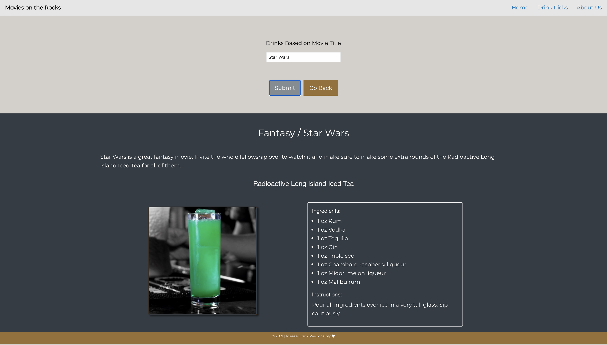

# Movies on the Rocks
A web application that shakes up your movie night by recommending beverages based on the flicks you're watching, so you feel part of all the action!

The webpage is hosted on [GitHub](https://mklakhan.github.io/movies-on-the-rocks/)

You can find the repo on [GitHub](https://github.com/mklakhan/movies-on-the-rocks)

## Approach
In this application we utilized the Open Movie Database (OMDb) API to implement a search for movie titles & the associated genres. We also utilized the Cocktail DB API to return drink results with ingredients & instructions. Once a user confirms they are of legal drinking age, the user is able to "Get Started" by entering in a movie title or genre. Once the input is submitted, drink results are returned with ingredients and instructions. 

### Future Development
- Ability for the user to select the alcohol type, so that recommendations are personalized for the preferences of the user.
- Ability to save the drink recommendations in a favorites section so that a user can easily retrieve the drink recipes they enjoyed.
- Ability to dislike a drink recommendation so that a user can generate an alternative recommendation.

 

## Screenshots

## Technologies & Credits
- Foundation - Responsive Front-End Framework - https://get.foundation/
- Google Fonts - https://fonts.google.com/
- CocktailDB API - https://www.thecocktaildb.com/api.php
- OMDb API - http://www.omdbapi.com/ 
- HTML
- CSS
- JavaScript
- JQuery
- Ajax

## Contributors
- Ryan Conat
- Matt Hayden
- Manpreet Lakhan
- David Sotomayor

